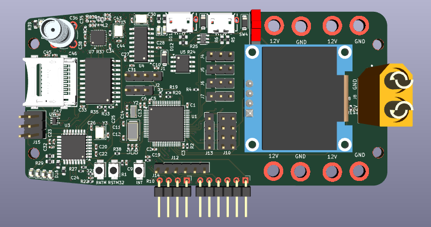
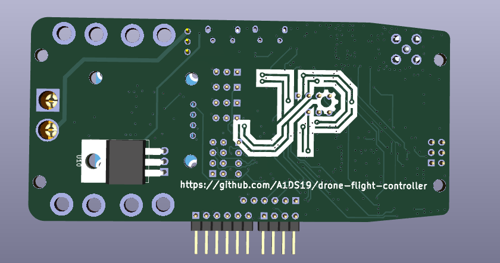

# Drone Flight Controller

A custom drone flight controller, designed in KiCad 10: an STM32F103R8T6 flight core paired with
an ATmega328P telemetry co-processor on a four-layer, ~102 × 49 mm PCB — taken from schematic
capture through placement, routing, clean ERC/DRC, and JLCPCB fabrication outputs
([pcb/production/](pcb/production/)).

## Features

- **STM32F103R8T6 flight core** — MPU-6050 IMU on I²C, four ESC/motor outputs, RC-receiver and
  TF-Luna LIDAR inputs, USB with ESD protection, SWD debug
- **ATmega328P telemetry co-processor** — nRF24L01P 2.4 GHz radio with SMA antenna connector,
  CH340G USB-serial, microSD logging over SPI, 5 V ↔ 3.3 V level shifting
- **Power tree** — XT60 battery input → LM7805 (5 V) → AMS1117 (3.3 V), filtered analog rail,
  battery-voltage sensing
- **0.96″ OLED** status display
- **Four-layer board** — solid internal ground plane, dedicated power planes, 71-line LCSC BOM,
  JLCPCB-ready Gerbers

## Screenshots

| Front | Back |
|-------|------|
|  |  |
